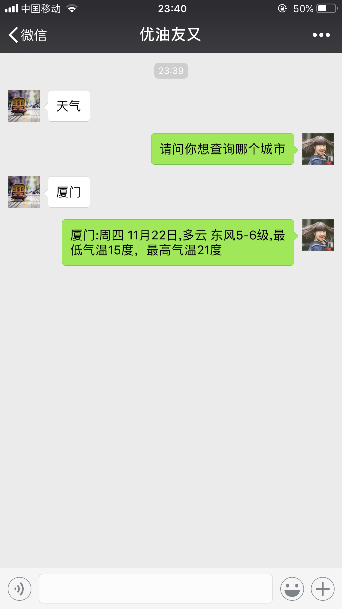
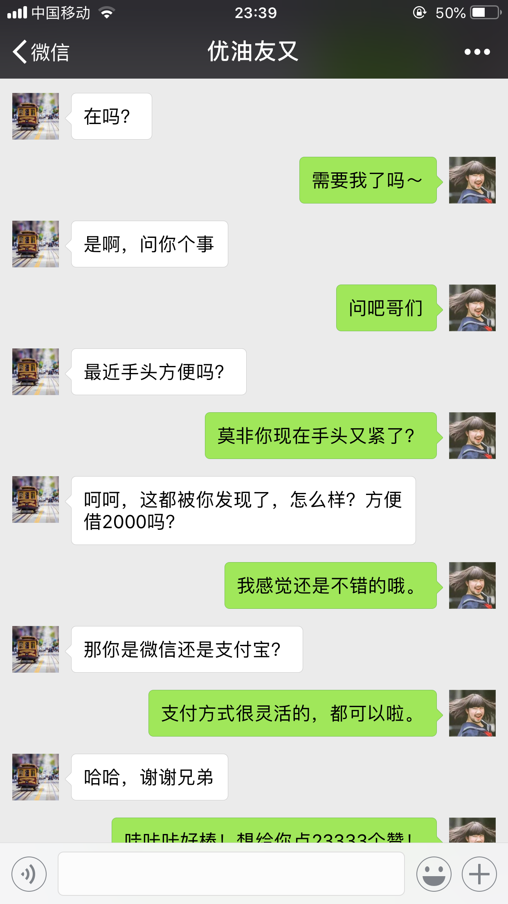

### 介绍

一个可以自动跟你好友对话的微信机器人。

让你的微信一秒变机器人。

实乃敷衍，调戏，折磨您好友的必备良器。




### 用法

```javascript
npm i
npm run robot
```

然后控制台会打印如下信息

> 请打开地址扫码登录  https://wx.qq.com/qrcode/xxxxxxxxxx

点击链接，在浏览器里显示二维码，用微信扫一扫，开启您的奇妙之旅吧

### 原理

看起来挺高大上的一个东西，实际上就是调用了微信的收发信息接口，然后把收到的信息传给 [图灵机器人](http://www.tuling123.com/) , 然后把机器人返回的信息，回复给好友。

为了您不被踢出群，目前是屏蔽了群消息的自动回复，如果您刚好需要开通此功能，可以去掉 `src/api/checkNewMessage.js` 第 36 行的 if 判断。

偷偷告诉你，去掉以后你会变成群活跃分子，那酸爽的感觉...我至今还在回味....苦苦哀求群主让我加回去的那段经历。

### 扩展
1. 监控数据，发现异常，立马发微信通知指定好友。
1. 模仿微信公众号的回复关键字功能。
1. 自动拉群，入群自动@群规等。
1. 做微信客服，处理一些常见问题。
1. <del>骚扰好友</del>增强好友间的亲密度，可以定时，定量给好友发消息, <del>如给某某发1万条消息</del>
1. 管理微信好友通讯录，群通讯录... <del>贩卖好友隐私</del>
1. 突破微信群发限制，并且可以群发时，加上对方昵称等

> 以上内容仅为个人觉得可行的思路，并未打算实现。

### 参考

https://github.com/maiff/Itchat/blob/master/doc/%E6%95%99%E7%A8%8B.md

https://github.com/Urinx/WeixinBot

https://blog.csdn.net/wonxxx/article/details/51787041